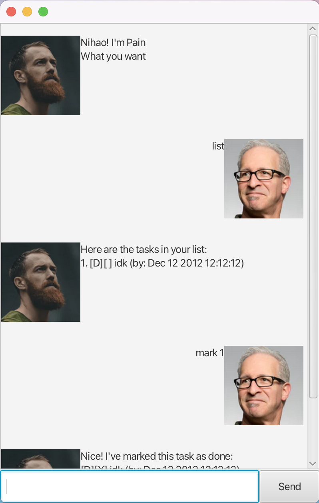

# Pain User Guide

**Pain** is a task managing chatbot that helps you keep track of your painful daily tasks quickly and clearly.
You can add todos, deadlines, and events, list and search tasks, and mark tasks as done—all through simple commands.

Pain is designed for fast workflow, with keyboard as the main input.

## Exiting the Program

**Command:** `bye`
Exits the application.

## Listing all Tasks

**Command:** `list`
Shows all tasks currently in your list.

## Adding Todo task
**Command:** `todo <description>`  
Adds a todo task.

Example:
`todo Homework`
`todo CS2103 iP`

## Adding Deadline task
**Command:** `deadline <description> /by <dd/MM/yyyy HH:mm:ss>`  
Adds a deadline task with a due date/time.

Example:
`deadline Homework /by 12/12/2012 12:12:12`
`deadline CS2103 iP /by 20/02/2026 23:59:59`

## Adding Event task
**Command:** `event <description> /from <dd/MM/yyyy HH:mm:ss> /to <dd/MM/yyyy HH:mm:ss>`  
Adds an event task with a start and end date/time.

Example:
`event Homework /from 11/11/2011 11:11:11 /to 12/12/2012 12:12:12`
`event CS2103 iP /from 01/01/2026 00:00:00 /to 20/02/2026 23:59:59`

## Finding task by description
**Command:** `find <keyword>`  
Lists tasks whose description contains the keyword.

Example:
`find Homework`

## Deleting task
**Command:** `delete <index>`  
Deletes the task at the given index (1-based).

Example:
`delete 1`

## Mark task as done
**Command:** `mark <index>`  
Marks the task at the given index as done (1-based).

Example:
`mark 1`

## Unmark task, changing status to not done
**Command:** `unmark <index>`  
Marks the task at the given index as not done (1-based).

Example:
`unmark 1`

## Acknowledgements
GUI implementation adapted from the CS2103T JavaFX tutorial, User and Pain image were also taken from the same tutorial.
  Adapted from https://se-education.org/guides/tutorials/javaFx.html